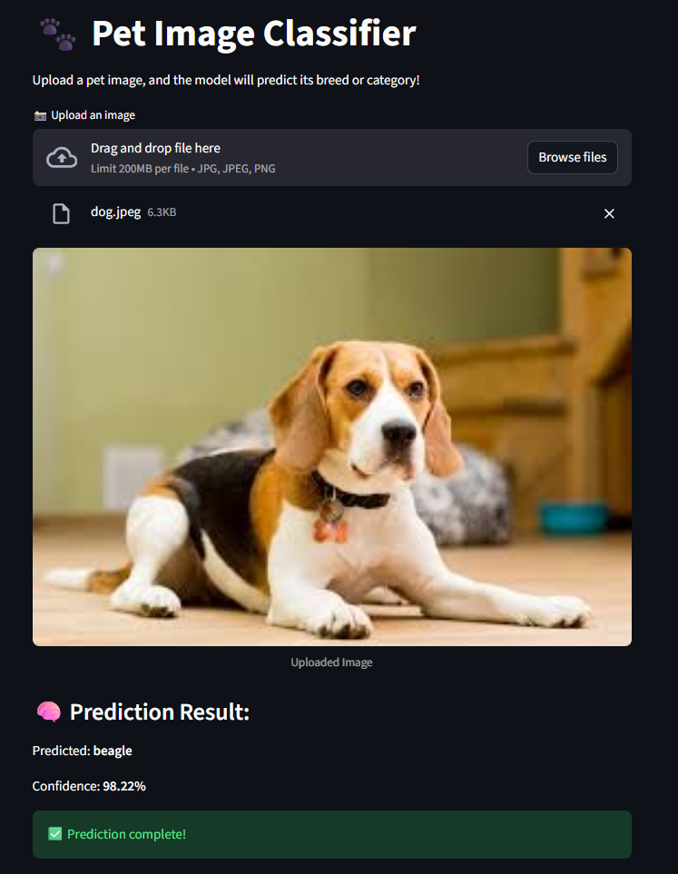

# 🐶🐱 Pet Image Classification with Streamlit & Docker

A deep learning image classification project built with TensorFlow, Streamlit, and Docker.
The model classifies images of dogs and cats from the Oxford-IIIT Pet Dataset using EfficientNetB0 transfer learning.
<br /><br />


## 🚀 Features

✅ Deep learning model using TensorFlow (EfficientNetB0)
✅ Web interface with Streamlit
✅ Experiment tracking with MLflow (optional)
✅ CI/CD automation using GitHub Actions
✅ Dockerized for easy local or cloud deployment
<br/><br/>


## 📂 Project Structure
<pre>
Image-classification/
├── src/
│   ├── data.py              # Data loading & preprocessing
│   ├── model.py             # Model architecture
│   ├── train.py             # Model training script
│   └── class_names.py       # Label mapping
├── app.py                   # Streamlit web app
├── saved_models/            # Trained model (.keras)
├── Dockerfile               # For containerization
├── requirements2.txt        # Python dependencies
└── .github/workflows/       # CI/CD pipeline
</pre>
<br/><br/>

## 🧠 How It Works

1. Training

- Loads the Oxford-IIIT Pet dataset
- Preprocesses images (resize, normalize to [0, 1])
- Uses EfficientNetB0 base model
- Trains for a few epochs with early stopping and checkpoints

2. Inference (Streamlit App)

- Upload an image
- Model predicts the class
- Shows top-3 predictions with confidence scores
<br/><br/>

## 🐳 Running with Docker (Recommended)
1️⃣ Build the Docker image
```bash
docker build -t pet-classifier:latest .
```
2️⃣ Run the container
PowerShell (Windows):
```bash
docker run --rm -p 8501:8501 -v "${PWD}:/app" pet-classifier:latest
```
Open browser 👉 http://localhost:8501
<br/><br/>

## 🧾 GitHub CI/CD

Each time you push a new tag like v1.0.0, GitHub Actions will:

- Read model metrics from metrics.json
- Create a GitHub Release with description and metrics
- Attach model files (.keras, .h5, metrics.json)
<br/><br/>


## 📸 Streamlit app (inside Docker)

